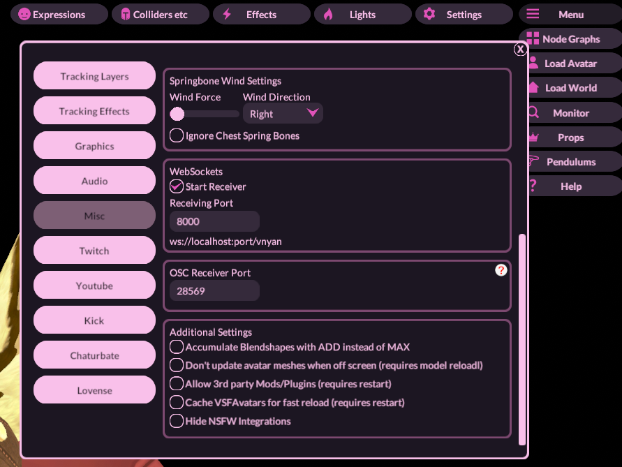

# Loupedeck to Vnyan Websocket Plugin
Tired of having toggles, but not enough hotkeys for all your actions? Look no further! The Vnyan Websocket Plugin for Loupedeck has you covered! 
This plug-in makes use of Vnyan's built-in localhost web socket server to receive and send messages! When set up, you can configure a button on your Loupedeck to send a custom message to Vnyan's websocket, allowing you to trigger node-graph based actions without the need for a hotkey.

Note: This plugin is for Loupedeck Streamdecks ONLY! Additionally, I have only tested this on LoupeDeck Live.

## How to Use:

### Prerequisites:
- Up to Date Loupedeck Software
- Vnyan

### How to use the Plugin:
1. Download the latest release of the Plug-in 
2. Install the lplug4 plug-in file via the Loupedeck Configuration Program (You might need to restart the Loupedeck service)
3. Unhide the VNyan Websocket plug-in
    - 
4. Click the "Websocket Connection" under VnyanWebsocket to set up a new button. The parameters are as follows:
    - Name: The name of the button
    - Enter Websocket Command: The message to send to Vnyan. Make sure it matches!
    - Example: I have a toggle for turning on and off my Vtuber sweater. So I have a button configured with the command "SweaterOn" and "SweaterOff"
    - 
5.  Open VNyan if you haven't already and start the Websocket server
    - Menu > Settings > Misc. > WebSockets
    - Make sure the Start Receiver is Checked
    - Make sure the Receiving Port is set to 8000 (I will add customizable ports at a later date)
    - 
6. Set up the Node Graph to receive the WebSocket Address
    - Menu > Node Graphs
    - Find the WebSocket CALLBACK Node
    - Set up the Command Text to match the appropriate Loupedeck button
    - 
7. The Loupedeck should connect and send the message to Vnyan, triggering any actions connected to the Node.
   
## Extra Notes:
Upon first press of the Plug-in button, Loupedeck will take a second or two to connect to WebSocket. Once established, the connection will remain until no inputs have been detected for 5 minutes, in which the connection will terminate. The connection will reconnect if an input is pressed after the plug-in has disconnected. 
    - This means that the first toggle press will not be immediate, however, while the connection is active, the toggles will be persistent.
